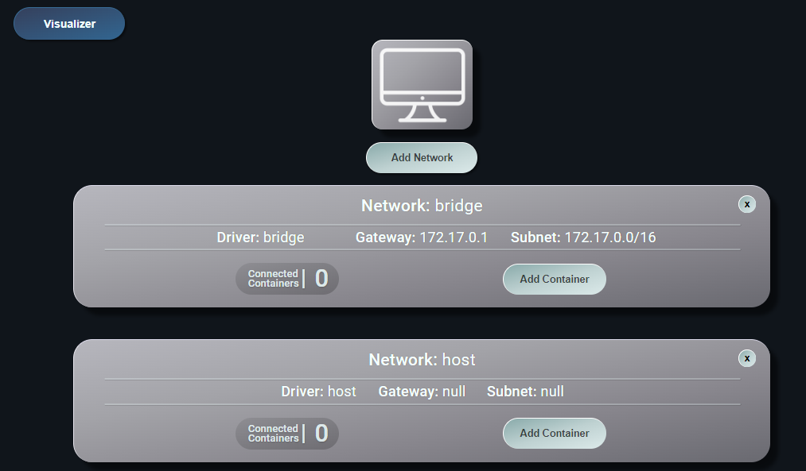

**Iván Gutiérrez Raimundo**

**DAW 2º DISTANCIA   2024-2025**

**DESPLIEGUE**


# ACTIVIDAD EVALUABLE- 3

## EJERCICIO 1


[TOC]


##### **1.Crear una red Bridge**

Primero descargo el plugin de `PortNavigator`  para poder configurar y crear redes desde Docker Desktop




Creo la red : `redej1` con el ese plugin en el botón `Add Network`


##### **2.Crea un contenedor con una imagen de `mariaDB` que estará en la red `redej1` ,accesible a través del puerto 3306. **

Bajamos la imagen y la ejecutamos directamente con run para crear el contenedor directamente.


Docker nos da la opción antes de ejecutarla de hacer algunas configuraciones, le ponemos el nombre al contenedor y el puerto, y  mediante variables de entorno le ponemos el nombre a la base de datos , una contraseña `root` que es obligatoria, un usuario y su contraseña.


Conectamos el contenedor de la base datos a la red `redej1` 


Vemos que la conexión esta creada y conectada. 


Entramos a la base de datos 

```
$docker exec -it miMariaDB bash
```

 y creamos los módulos:


Vemos los módulos de la base de datos creados:


##### **3.Creamos un contenedor con `phpMyAdmin` que se pueda conectar al contenedor de la BD**


Vemos el contenedor


Lo conectamos a la red `redej1`


Vemos los dos contenedores conectados a la misma red:


##### **4.Conexión a la base de datos por la interfaz gráfica** 


Vemos la tabla creada con los módulos. 


##### **5.Instalamos la extensión `Disk Usage` que muestra el espacio ocupado**


