**Iván Gutiérrez Raimundo**

**DAW 2º DISTANCIA   2024-2025**

**DESPLIEGUE**


# ACTIVIDAD EVALUABLE- 3

## EJERCICIO 2


[TOC]

##### **1.Fichero `compose.yaml`**

Ponemos tres servicios ,la propia aplicación `filebrowser` (son su imagen, su puerto, volúmenes usados , variables de entorno necesarias y la opción `restart` para reiniciarse en caso de problemas), una base de datos `mariaDB` (donde incluimos variables de entorno para la contraseña y nombre , y su propio volumen para persistir los datos), y un servidor `nginx`. Por último añadimos los volúmenes usados anteriormente.

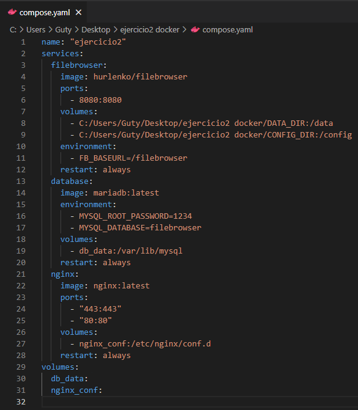


Ejecutamos el compose creado con el comando :

```bash
$ docker compose up -d
```


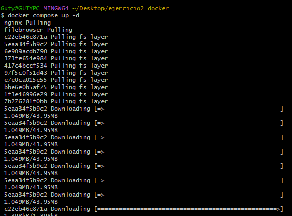

Vemos que se creo el multicontenedor compose desde Docker desktop

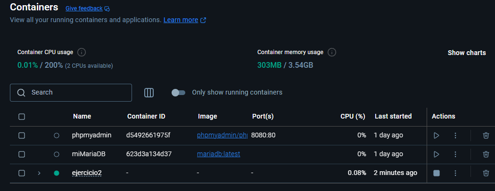


Vemos los contenedores que lo componen :

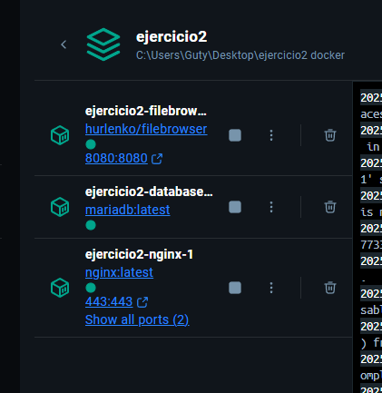

##### **2.Aplicación funcionando **

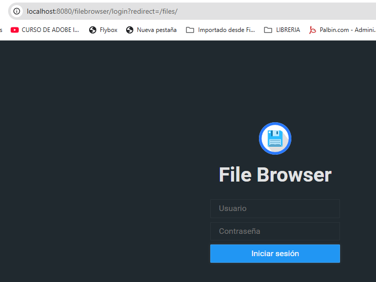

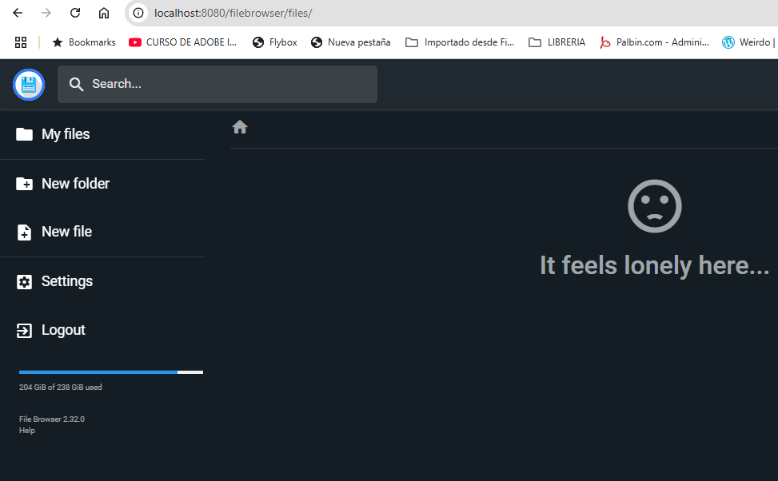


Vamos a realizar un par de operaciones para luego ver en las carpetas de los volúmenes si se registraron correctamente, primero subimos un fichero y luego cambiamos el idioma  a español.

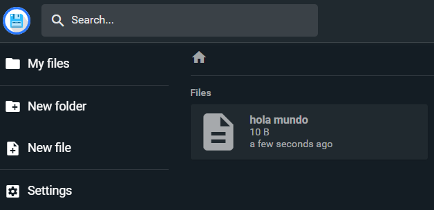

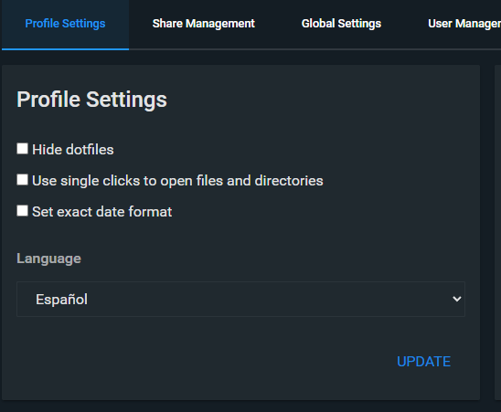

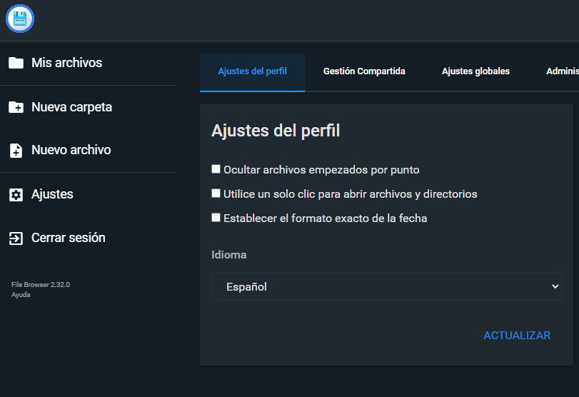


##### **3.Carpetas de los volúmenes**

Vemos las dos carpetas creadas para guardar los volúmenes y sus datos 

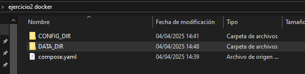

Aquí es donde guarda los datos de configuración de la aplicación,como el cambio del idioma


Aquí es donde guarda los datos como  los ficheros

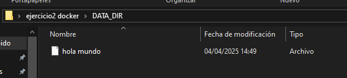

Podemos ver los volúmenes creados con este comando :

```bash
$ docker volume ls
```

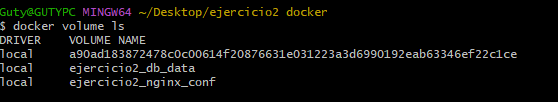

NOTA: Al finalizar el ejercicio me doy cuenta que no es recomendable guardar los volúmenes en una ruta local con subcarpetas ya que si quiero exportar el proyecto en otro equipo tendría que crear todo ese árbol de subcarpetas, mejor configurar el `compose.yaml` con una ruta para los volúmenes mas sencilla como: `C:/` o `C:/volumenes`, en principio lo hice así para que quedaran guardados en la carpeta del ejercicio.

##### **4. Funcionamiento de la aplicación**

Filebrowser es una aplicación de gestión de archivos, de manera grafica e intuitiva, permite crear, eliminar, renombrar, previsualizar y editar archivos y carpetas. También puedes subir y descargar archivos fácilmente.
Su propósito principal es facilitar la gestión de archivos y carpetas desde un navegador y además al ser una herramienta basada en la web, puedes acceder a tus archivos desde cualquier lugar con conexión a internet.
Permite la creación de múltiples usuarios y cada usuario puede tener su propio directorio.

