**Iván Gutiérrez Raimundo**

**DAW 2º DISTANCIA   2024-2025**

**DESPLIEGUE**


# ACTIVIDAD EVALUABLE- 3

## EJERCICIO 3


[TOC]

##### **1.Creación del fichero `dockerfile`**

Configuramos el `dockerfile` con una imagen base de `php:7.4-apache` ,una carpeta externa `public_html` que será copiada en `/var/www/html` dentro del contenedor, en el puerto 8000.

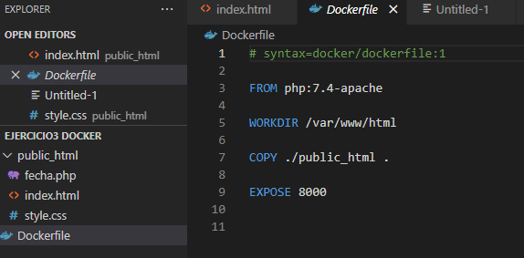

Creamos dicha carpeta


Y los ficheros en su interior, `index.html`, `sytle.css` y el script `fecha.php`

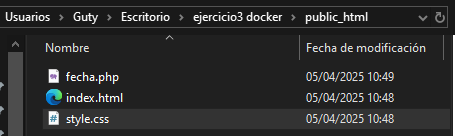

##### **2.Construimos la imagen**

`$ docker build -t ejercicio3 .`

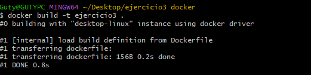

Vemos la imagen en Docker desktop


Ejecutamos la imagen para crear el contenedor en el puerto 8000:80

```bash
$ docker run -d -p 8000:80 --name ejercicio3 ejercicio3
```

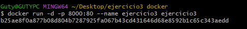

Vemos el contenedor en Docker desktop:


##### **3. Acceso por navegador**

Acceso al navegador con la página `index.html`:

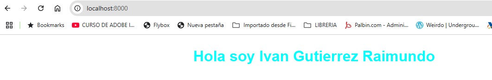

Acceso con el script `fecha.php`:

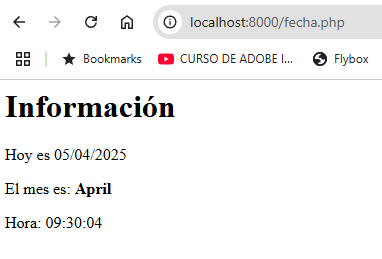

##### **4. Subida de imagen a Docker Hub**

En este punto me doy cuenta que si no pongo el tag con el autor no me deja subirlo al repositorio de `dockerhub` así que añado la etiqueta con este código:
`$ docker tag ejercicio3 ivangutierrezraimundo/ejercicio3:v1`

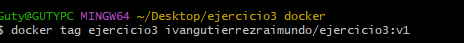

Lo subo a Docker Hub con Docker desktop (`Push to Docker Hub`)

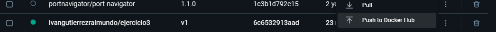

Imagen subida correctamente

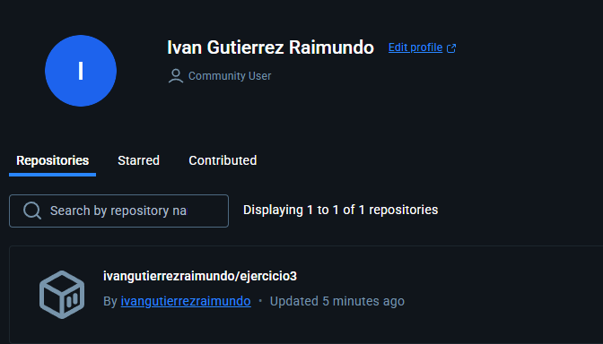

Borramos la imagen en el repositorio local con Docker desktop

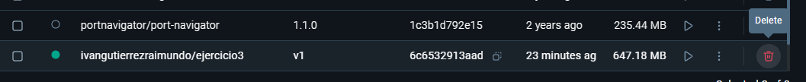

##### **5.Descarga de imagen desde Docker Hub**

Descargamos la imagen del repositorio remoto al local (Pull)


##### **6. Nuevo contenedor en puerto `-p 1234:80`**

Ejecutamos la imagen para crear otro contenedor pero esta vez en el puerto 1234:80

```bash
$ docker run -d -p 1234:80 --name ejercicio3_puerto1234 ivangutierrezraimundo/ejercicio3:v1
```

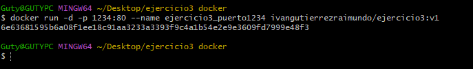

Contenedor creado


Acceso al navegador con el `index.html` con el nuevo puerto

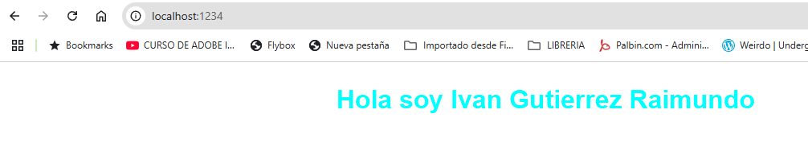

Acceso del script `fecha.php` desde el otro puerto

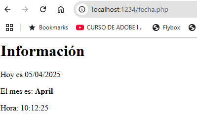

##### **7. Borrado del contenedor**

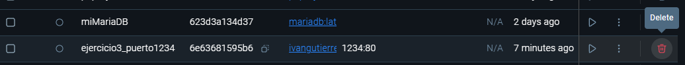


